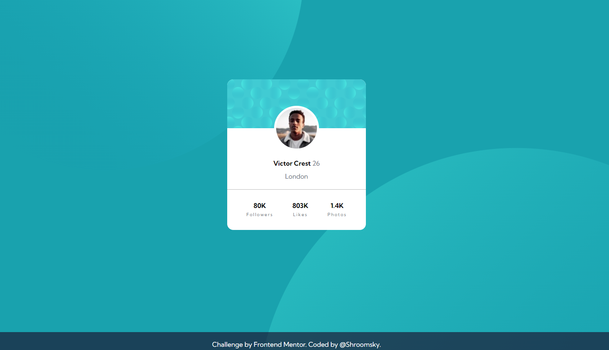

# Frontend Mentor - Profile card component solution

This is a solution to the [Profile card component challenge on Frontend Mentor](https://www.frontendmentor.io/challenges/profile-card-component-cfArpWshJ). Frontend Mentor challenges help you improve your coding skills by building realistic projects. 

## Table of contents

- [Overview](#overview)
  - [The challenge](#the-challenge)
  - [Screenshot](#screenshot)
  - [Links](#links)
  - [Built with](#built-with) 
- [Author](#author)

## Overview

### The challenge

- Build out the project to the designs provided

### Screenshot

### Links

- Solution URL: [https://shroomsky.github.io/profile-card-component-main/](https://shroomsky.github.io/profile-card-component-main/)

### Built with

- Mobile-first workflow
- Flexbox
- CSS custom properties
- Semantic HTML5 markup

## Author

- Frontend Mentor - [@Shroomsky](https://www.frontendmentor.io/profile/Shroomsky)

